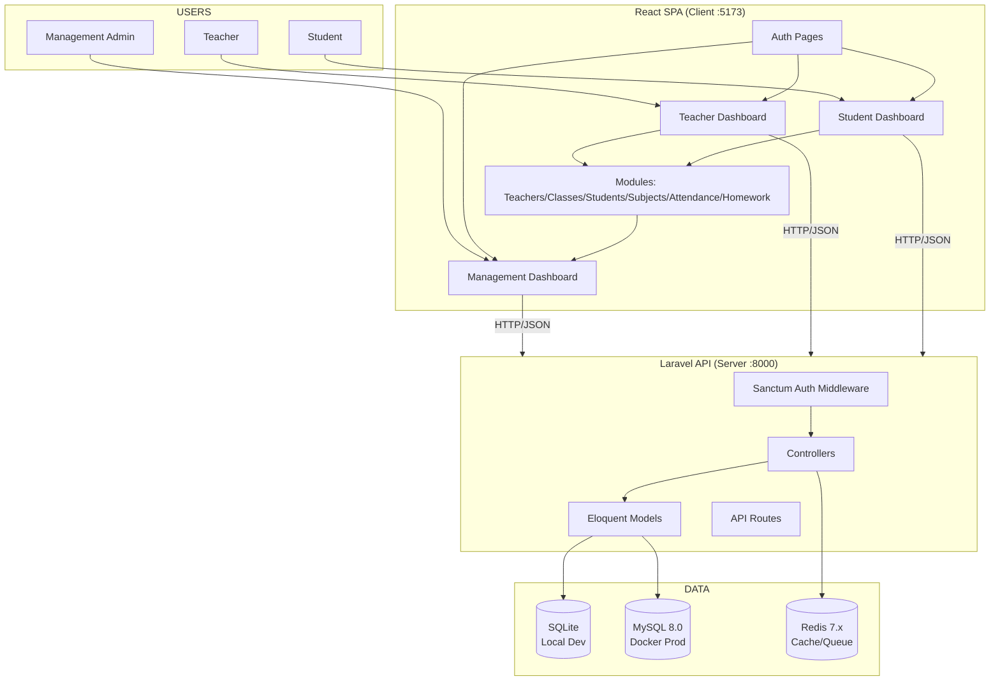
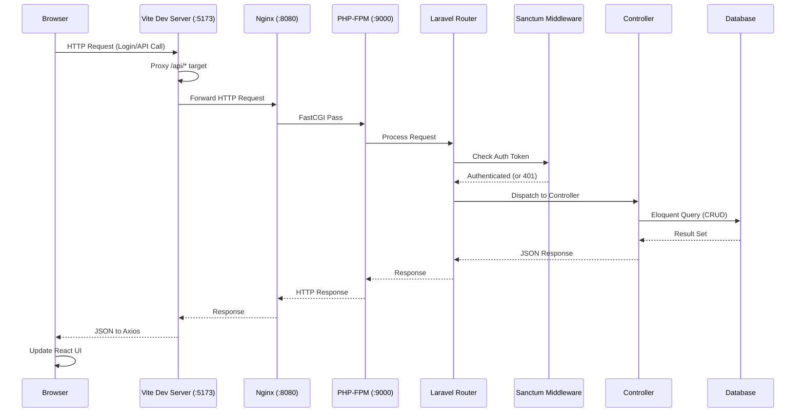
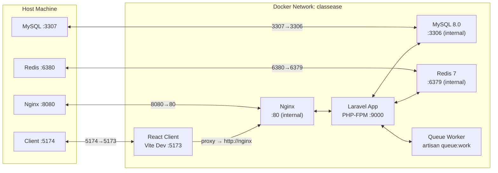
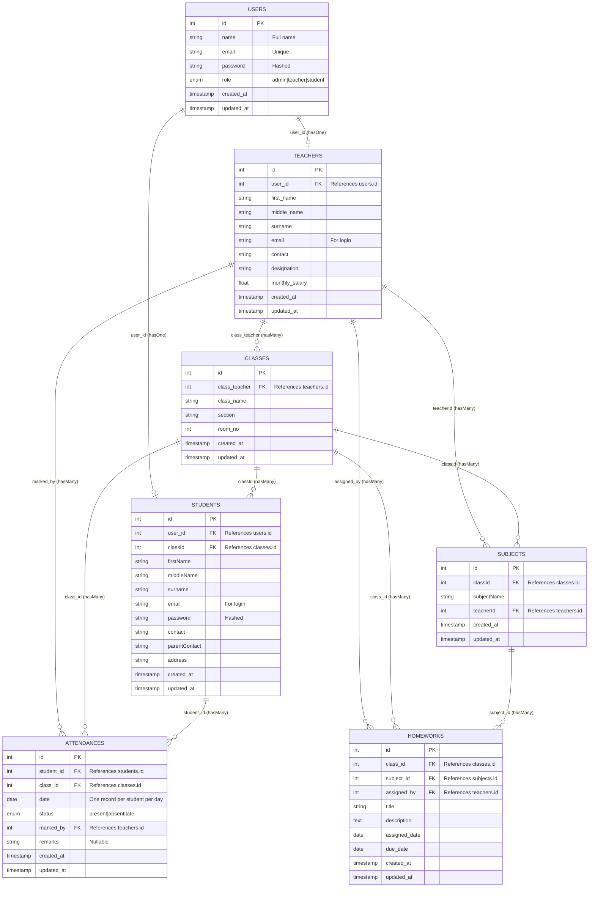
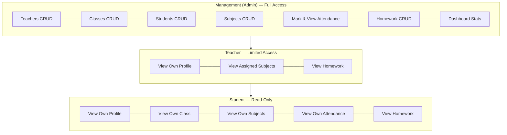

# ClassEase — Project Journal

---

**Project Title:** ClassEase — School Management System

**Prepared By:** Shaikh Farhan

**Date Started:** August 2026

**Last Updated:** September 4, 2026

---

## Table of Contents

1. [Project Overview](#1-project-overview)
2. [Problem Statement](#2-problem-statement)
3. [Objectives](#3-objectives)
4. [Tech Stack](#4-tech-stack)
5. [System Architecture](#5-system-architecture)
6. [Database Design](#6-database-design)
7. [Project Structure](#7-project-structure)
8. [User Roles & Permissions](#8-user-roles--permissions)
9. [Features Implemented](#9-features-implemented)
10. [API Endpoints](#10-api-endpoints)
11. [Frontend Pages](#11-frontend-pages)
12. [Daily Progress Log](#12-daily-progress-log)
13. [Future Scope](#13-future-scope)

---

## 1. Project Overview

**ClassEase** is a comprehensive school management system designed to streamline administrative tasks, teacher workflows, and student engagement. It provides role-based dashboards for management, teachers, and students, enabling efficient handling of classes, subjects, attendance, homework, and more.

The system is built as a full-stack web application with a Laravel 13 backend API and a standalone React SPA frontend, communicating via RESTful API endpoints secured with Laravel Sanctum authentication.

---

## 2. Problem Statement

Traditional school management involves manual paperwork, scattered data, and inefficient communication between administration, teachers, and students. Key challenges include:

- **Attendance Tracking:** Manual attendance registers are prone to errors and take valuable class time.
- **Homework Management:** Teachers struggle to assign and track homework across multiple classes.
- **Data Silos:** Student, teacher, and class data often exist in separate systems.
- **Lack of Real-time Insights:** Administrators lack instant visibility into school metrics.
- **Communication Gap:** No centralized platform for announcements and concerns.

ClassEase addresses these challenges by providing a unified digital platform with role-based access.

---

## 3. Objectives

### Primary Objectives

1. Build a centralized platform for managing school operations
2. Implement role-based access control (Management, Teacher, Student)
3. Digitize attendance tracking with bulk marking capability
4. Enable homework assignment and tracking
5. Provide real-time dashboard statistics

### Secondary Objectives

6. Track student performance and scores
7. Implement a leaderboard system
8. Enable announcements and communication
9. Create a digital timetable
10. Build a concerns/complaints system

---

## 4. Tech Stack

### Backend

| Technology | Version | Purpose |
|---|---|---|
| PHP | 8.3+ | Server-side language |
| Laravel | 13.x | PHP framework |
| Laravel Sanctum | 4.x | API token authentication |
| SQLite | — | Local development database |
| MySQL | 8.0 | Production database (Docker) |
| Redis | 7.x | Cache, sessions, queue (Docker) |

### Frontend

| Technology | Version | Purpose |
|---|---|---|
| React | 18.x | UI library |
| React Router | — | Client-side routing |
| Axios | — | HTTP client |
| Tailwind CSS | 3.4.x | Utility-first CSS framework |
| Vite | — | Build tool & dev server |

### DevOps

| Technology | Purpose |
|---|---|
| Docker | Containerized development environment |
| Nginx | Reverse proxy for Laravel |
| Git | Version control |

---

## 5. System Architecture

### 5.1 High-Level Architecture



### 5.2 Request Flow Diagram (Sequence)



### 5.3 Docker Architecture



---

## 6. Database Design

### 6.1 Entity Relationship Diagram (ERD)



### 6.2 Database Tables Summary

| Table | Records | Purpose |
|---|---|---|
| `users` | Admin, teachers, students | Authentication & roles |
| `teachers` | Teacher profiles | Personal info, designation, salary |
| `classes` | Class sections | Class name, section, room, teacher |
| `students` | Student profiles | Personal info, parent contact |
| `subjects` | Subjects per class | Subject name, assigned teacher |
| `attendances` | Daily records | Student presence tracking |
| `homeworks` | Assignments | Title, description, due dates |
| `personal_access_tokens` | Sanctum tokens | API authentication |
| `cache` | Laravel cache | Performance optimization |
| `jobs` | Queue jobs | Background processing |

### 6.3 Migration Timeline

| Date | Migration | Purpose |
|---|---|---|
| 2026-08-01 | `create_users_table` | User authentication |
| 2026-08-01 | `create_cache_table` | Laravel caching |
| 2026-08-01 | `create_jobs_table` | Queue processing |
| 2026-08-04 | `create_teachers_table` | Teacher profiles |
| 2026-08-04 | `create_classes_table` | Class management |
| 2026-08-04 | `create_students_table` | Student profiles |
| 2026-08-15 | `create_personal_access_tokens_table` | Sanctum tokens |
| 2026-08-16 | `create_subjects_table` | Subject management |
| 2026-08-18 | `add_email_to_teachers_table` | Teacher email field |
| 2026-08-18 | `add_email_password_to_students_table` | Student auth fields |
| 2026-09-04 | `create_attendances_table` | Attendance tracking |
| 2026-09-04 | `create_homeworks_table` | Homework management |

---

## 7. Project Structure

```
ClassEase/
├── classEase/                    # Laravel 13 Backend
│   ├── app/
│   │   ├── Http/
│   │   │   ├── Controllers/
│   │   │   │   ├── AuthController.php
│   │   │   │   ├── AttendanceController.php
│   │   │   │   ├── ClassesController.php
│   │   │   │   ├── DashboardController.php
│   │   │   │   ├── HomeworkController.php
│   │   │   │   ├── StudentController.php
│   │   │   │   ├── SubjectController.php
│   │   │   │   └── TeacherController.php
│   │   │   └── Middleware/
│   │   │       └── RoleMiddleware.php
│   │   ├── Models/
│   │   │   ├── User.php
│   │   │   ├── Teacher.php
│   │   │   ├── classes.php
│   │   │   ├── Student.php
│   │   │   ├── Subject.php
│   │   │   ├── Attendance.php
│   │   │   └── Homework.php
│   │   └── Resources/
│   │       └── ClassesResource.php
│   ├── database/
│   │   ├── migrations/          # 12 migration files
│   │   ├── seeders/
│   │   │   ├── DatabaseSeeder.php
│   │   │   └── ClassEaseTestDataSeeder.php
│   │   └── factories/
│   │       └── UserFactory.php
│   ├── routes/
│   │   ├── api.php              # All API routes
│   │   └── web.php              # Minimal web routes
│   └── .env                     # SQLite config (local)
│
├── client/                      # React SPA (Standalone)
│   ├── src/
│   │   ├── api/                 # Axios API layer
│   │   │   ├── axios.ts
│   │   │   ├── attendance.ts
│   │   │   ├── classes.ts
│   │   │   ├── dashboard.ts
│   │   │   ├── homework.ts
│   │   │   ├── students.ts
│   │   │   ├── subjects.ts
│   │   │   └── teachers.ts
│   │   ├── components/          # Reusable UI components
│   │   │   ├── Button.tsx
│   │   │   ├── DashboardLayout.tsx
│   │   │   ├── PlaceholderPage.tsx
│   │   │   ├── Sidebar.tsx
│   │   │   └── StatusBadge.tsx
│   │   ├── context/
│   │   │   └── AuthContext.tsx
│   │   ├── layouts/
│   │   │   └── DashboardLayout.tsx
│   │   ├── pages/
│   │   │   ├── auth/            # Login, Register
│   │   │   ├── management/      # Management dashboard & modules
│   │   │   ├── teacher/         # Teacher dashboard
│   │   │   └── student/         # Student dashboard
│   │   ├── routes/
│   │   │   ├── AppRouter.tsx
│   │   │   └── ProtectedRoute.tsx
│   │   ├── types/
│   │   │   └── index.ts
│   │   └── main.tsx
│   ├── tailwind.config.js
│   └── vite.config.ts
│
├── docker/                      # Docker configuration
│   ├── client/                  # Client Dockerfile
│   ├── mysql/                   # MySQL init scripts
│   ├── nginx/                   # Nginx config
│   └── php/                     # PHP-FPM Dockerfile
│
├── docker-compose.yml           # Full stack orchestration
├── PROJECT_CONTEXT.md           # Development checkpoint
└── AGENTS.md                    # Agent instructions
```

---

## 8. User Roles & Permissions

### Role Hierarchy



### Permission Matrix

| Feature | Management | Teacher | Student |
|---|:---:|:---:|:---:|
| Dashboard Stats | Yes | No | No |
| Teacher CRUD | Yes | No | No |
| Class CRUD | Yes | No | No |
| Student CRUD | Yes | No | No |
| Subject CRUD | Yes | No | No |
| Class roster (view students in a class) | Yes | Yes | No |
| View teacher / subject detail | Yes | Yes | No |
| Mark Attendance | Yes | Yes | No |
| View Attendance | Yes | Own class | Own |
| Assign Homework | Yes | Yes | No |
| View Homework | Yes | Yes | Own class |
| Record / Edit / Delete Scores | Yes | Yes | No |
| View Scores | Yes | Yes | Own |
| Post Announcements | Yes | Yes | No |
| View Announcements | Yes | Yes | Own class + general |
| View Leaderboard | Yes | Yes | Read-only |
| View Own Profile | Yes | Yes | Yes |

> **Enforced server-side (2026-09-06)** via the `role` middleware on every authenticated
> route. Previously every authenticated user could call any endpoint; now each route is gated
> to `role:admin`, `role:admin,teacher`, or `role:admin,teacher,student`.

---

## 9. Features Implemented

### Module 1: Authentication
- User registration — self-registration creates a **student** account only (role is forced
  server-side; a client-supplied role is ignored)
- Login with email/password
- Sanctum token-based authentication
- Logout functionality
- Protected routes with role guards
- **Role-based access control (2026-09-06)** — `role:admin`, `role:admin,teacher`, and
  `role:admin,teacher,student` middleware groups enforce access on every API route

### Module 2: Teacher Management
- List all teachers
- Add new teacher
- Edit teacher details
- Delete teacher
- View teacher subjects

### Module 3: Class Management
- List all classes with teacher info
- Add new class
- Edit class details
- Delete class

### Module 4: Student Management
- Browse students by class
- Add new student
- Edit student details
- Delete student
- View student subjects

### Module 5: Subject Management
- List all subjects
- Add new subject
- Edit subject details
- Delete subject
- View subject details

### Module 6: Dashboard
- Management: Stats cards (Teachers, Students, Classes, Subjects)
- Teacher: Profile info + assigned subjects
- Student: Profile info + class + subjects

### Module 7: Attendance
- Mark attendance (bulk per class)
- Select class + date
- Toggle Present/Absent/Late per student
- View attendance by class + date
- Attendance summary (counts)
- Unique constraint: one record per student per day

### Module 8: Homework
- Assign homework (class, subject, title, dates)
- List homework by class
- Edit homework
- Delete homework
- Overdue indicator
- Student view (by class)

### Module 9: Scores
- Record marks per student, subject and exam
- Three exam types (Unit Test, Midterm Exam, Final Exam)
- List scores by class with exam filter
- Edit and delete scores
- Percentage display
- Duplicate guard (one score per student/subject/exam)
- Student portal score card

### Module 10: Leaderboard
- Rank students by overall average percentage per class
- Optional exam filter (Unit Test / Midterm Exam / Final Exam)
- Top-3 podium styling (gold / silver / bronze rank badges)
- Class + exam aware, computed on the fly from scores (no extra table)

### Module 11: Announcements
- Post announcements to a specific class or to all classes (general)
- List/edit/delete announcements, newest first
- Audience + poster (management/teacher) shown per announcement
- Student portal shows announcements for their class plus general ones

### Module 12: Timetable
- Per-class weekly schedule: rows = periods, columns = Monday–Friday
- Grid editor for management (subject per cell, add/remove period rows, bulk save)
- Teacher portal shows their own teaching periods (by teacher_id)
- Student portal shows their class's schedule
- Bulk save is idempotent (updateOrCreate per class/day/period, removed slots deleted)

### Module 13: Concerns
- Students raise concerns (subject + description) — student_id derived from the authenticated account
- Admin/teacher view all concerns, set status (open / in_progress / resolved) and reply
- Auto-records who resolved a concern (resolved_by); students are scoped to their own concerns
- Student portal: raise + track (status badge + admin reply); teacher portal: view/manage (no delete)

---

## 10. API Endpoints

### Authentication (Public)

| Method | Endpoint | Description |
|---|---|---|
| POST | `/api/login` | User login |
| POST | `/api/register` | User registration |

### Authentication (Protected)

| Method | Endpoint | Description |
|---|---|---|
| GET | `/api/me` | Get current user |
| POST | `/api/logout` | Logout |

### Dashboard

| Method | Endpoint | Description |
|---|---|---|
| GET | `/api/dashboard/stats` | Get dashboard statistics |

### Teachers

| Method | Endpoint | Description |
|---|---|---|
| GET | `/api/teachers` | List all teachers |
| GET | `/api/teachers/{id}` | Get teacher details |
| POST | `/api/teachers` | Create teacher |
| PUT | `/api/teachers/{id}` | Update teacher |
| DELETE | `/api/teachers/{id}` | Delete teacher |
| GET | `/api/teacher/{id}/subjects` | Get teacher's subjects |

### Classes

| Method | Endpoint | Description |
|---|---|---|
| GET | `/api/classes` | List all classes |
| GET | `/api/classes/{id}` | Get class details |
| POST | `/api/classes` | Create class |
| PUT | `/api/classes/{id}` | Update class |
| DELETE | `/api/classes/{id}` | Delete class |

### Students

| Method | Endpoint | Description |
|---|---|---|
| POST | `/api/students` | Create student |
| GET | `/api/student/{id}` | Get student details |
| PUT | `/api/student/{id}` | Update student |
| DELETE | `/api/student/{id}` | Delete student |
| GET | `/api/student/class/{id}` | List students by class |
| GET | `/api/student/{id}/subjects` | Get student's subjects |

### Subjects

| Method | Endpoint | Description |
|---|---|---|
| GET | `/api/subjects` | List all subjects |
| GET | `/api/subjects/{id}` | Get subject details |
| POST | `/api/subjects` | Create subject |
| PUT | `/api/subjects/{id}` | Update subject |
| DELETE | `/api/subjects/{id}` | Delete subject |

### Attendance

| Method | Endpoint | Description |
|---|---|---|
| POST | `/api/attendance` | Mark attendance (bulk) |
| GET | `/api/attendance/class` | Get class attendance by date |
| GET | `/api/attendance/student/{id}` | Get student attendance history |
| PUT | `/api/attendance/{id}` | Update attendance record |

### Homework

| Method | Endpoint | Description |
|---|---|---|
| POST | `/api/homework` | Create homework |
| GET | `/api/homework/{id}` | Get homework details |
| PUT | `/api/homework/{id}` | Update homework |
| DELETE | `/api/homework/{id}` | Delete homework |
| GET | `/api/homework/class/{classId}` | List homework by class |
| GET | `/api/homework/student/{studentId}` | List homework by student |

### Scores

| Method | Endpoint | Description |
|---|---|---|
| POST | `/api/scores` | Record a score |
| GET | `/api/scores/{id}` | Get score details |
| PUT | `/api/scores/{id}` | Update score |
| DELETE | `/api/scores/{id}` | Delete score |
| GET | `/api/scores/class/{classId}` | List scores by class |
| GET | `/api/scores/student/{studentId}` | List scores by student |

### Leaderboard

| Method | Endpoint | Description |
|---|---|---|
| GET | `/api/leaderboard/class/{classId}?exam=` | Rank students in a class by average % (optional exam filter) |

### Announcements

| Method | Endpoint | Description |
|---|---|---|
| POST | `/api/announcements` | Create an announcement (class_id null = general) |
| GET | `/api/announcements` | List all announcements (newest first) |
| GET | `/api/announcements/{id}` | Get announcement details |
| PUT | `/api/announcements/{id}` | Update announcement |
| DELETE | `/api/announcements/{id}` | Delete announcement |
| GET | `/api/announcements/class/{classId}` | List class announcements + general ones |
| GET | `/api/announcements/student/{studentId}` | List a student's class + general announcements |

### Timetable (Protected)

| Method | Endpoint | Description |
|---|---|---|
| POST | `/api/timetable` | Bulk save a class's timetable grid (admin/teacher) |
| PUT | `/api/timetable/{id}` | Update a single timetable entry (admin/teacher) |
| DELETE | `/api/timetable/{id}` | Delete a timetable entry (admin/teacher) |
| GET | `/api/timetable/class/{classId}` | Get a class's timetable |
| GET | `/api/timetable/teacher/{teacherId}` | Get a teacher's teaching periods |

### Concerns (Protected)

| Method | Endpoint | Description |
|---|---|---|
| POST | `/api/concerns` | Student raises a concern (role: student) |
| GET | `/api/concerns` | List all concerns, newest first (admin/teacher) |
| PUT | `/api/concerns/{id}` | Update status and/or admin reply (admin/teacher) |
| DELETE | `/api/concerns/{id}` | Delete a concern (admin/teacher) |
| GET | `/api/concerns/student/{studentId}` | List a student's concerns (students see only their own) |
| GET | `/api/concerns/{id}` | Get a single concern (students see only their own) |

---

## 11. Frontend Pages

### Page Structure

```
Authentication
├── Login.tsx
├── Register.tsx
└── Unauthorized.tsx

Management Dashboard
├── Dashboard.tsx              (Stats cards)
├── Teachers/
│   ├── TeacherList.tsx
│   ├── AddTeacher.tsx
│   └── EditTeacher.tsx
├── Classes/
│   ├── ClassList.tsx
│   └── ClassForm.tsx
├── Students/
│   ├── StudentsByClass.tsx
│   ├── AddStudent.tsx
│   ├── EditStudent.tsx
│   └── StudentSubjects.tsx
├── Subjects/
│   ├── SubjectList.tsx
│   └── SubjectForm.tsx
├── Attendance/
│   ├── MarkAttendance.tsx
│   └── ViewAttendance.tsx
├── Homework/
│   ├── HomeworkList.tsx
│   ├── AddHomework.tsx
│   └── EditHomework.tsx
└── Scores/
    ├── ScoresByClass.tsx
    ├── AddScore.tsx
    ├── EditScore.tsx
    └── exams.ts
└── Leaderboard/
    └── LeaderboardByClass.tsx
└── Announcements/
    ├── AnnouncementList.tsx
    ├── AddAnnouncement.tsx
    └── EditAnnouncement.tsx
└── Timetable/
    └── TimetableGrid.tsx

Teacher Dashboard
├── Dashboard.tsx              (Profile + Subjects)
├── Timetable.tsx              (Own teaching periods)
└── Teacher subjects view (management → TeacherSubjects.tsx)

Student Dashboard
├── Dashboard.tsx              (Profile + Class + Subjects + Scores)
└── Timetable.tsx              (Own class schedule)
```

### Navigation Flow

```mermaid
graph TD
    START([Login Page]) --> AUTH{Auth Context<br/>Check Token}
    AUTH -->|No token| START
    AUTH -->|Valid token| ROLE{User Role}

    ROLE -->|admin| ADASH[Management Dashboard<br/>/management/dashboard]
    ROLE -->|teacher| TDASH[Teacher Dashboard<br/>/teacher/dashboard]
    ROLE -->|student| SDASH[Student Dashboard<br/>/student/dashboard]

    ADASH --> ASTUD[Students<br/>/management/students]
    ADASH --> ATEACH[Teachers<br/>/management/teachers]
    ADASH --> ACLASS[Classes<br/>/management/classes]
    ADASH --> ASUBJ[Subjects<br/>/management/subjects]
    ADASH --> AATT[Attendance<br/>/management/attendance/mark<br/>/management/attendance/view]
    ADASH --> AHW[Homework<br/>/management/homework]
    ADASH --> ASCORE[Scores<br/>/management/scores]
    ADASH --> ALEAD[Leaderboard<br/>/management/leaderboard]
    ADASH --> AANN[Announcements<br/>/management/announcements]
    ADASH --> ATT[Timetable<br/>/management/timetable]

    ASTUD --> ASTUD1[Students by Class]
    ASTUD --> ASTUD2[Add Student]
    ASTUD --> ASTUD3[Edit Student]
    ASTUD --> ASTUD4[Student Subjects]

    ATEACH --> ATEACH1[Add Teacher]
    ATEACH --> ATEACH2[Edit Teacher]
    ATEACH --> ATEACH3[Teacher Subjects]

    ACLASS --> ACLASS1[Add Class]

    ASUBJ --> ASUBJ1[Add Subject]

    AHW --> AHW1[Add Homework]
    AHW --> AHW2[Edit Homework]

    ASCORE --> ASCORE1[Add Score]
    ASCORE --> ASCORE2[Edit Score]

    ALEAD --> ALEAD1[Rank by Class]
    ALEAD --> ALEAD2[Filter by Exam]

    AANN --> AANN1[Add Announcement]
    AANN --> AANN2[Edit Announcement]

    ATT --> ATT1[Select Class]
    ATT --> ATT2[Edit Period Grid]
    ATT --> ATT3[Save Grid]

    TDASH --> TSUBJ[Assigned Subjects]
    TDASH --> TT[Own Timetable]
    SDASH --> SCONTS[Own Class & Subjects]
    SDASH --> SCORES[Own Scores]
    SDASH --> SANN[Own Announcements]
    SDASH --> ST[Own Timetable]
```



---

## 12. Daily Progress Log

### Day 1 — August 4, 2026
**Task:** Database & Models Setup
- Created Laravel 13 project
- Set up database migrations for users, teachers, classes, students
- Created Eloquent models with relationships
- Established project structure

### Day 2 — August 15-16, 2026
**Task:** Subject Module
- Created subjects migration and model
- Built SubjectController with CRUD operations
- Added API routes for subjects
- Set up Sanctum authentication

### Day 3 — August 18, 2026
**Task:** Database Enhancements
- Added email field to teachers table
- Added email and password fields to students table
- Updated seeder with test accounts
- Set up Docker environment

### Day 4 — August 19, 2026
**Task:** Full Stack Integration
- Dockerized the entire stack (MySQL, Redis, Nginx, PHP-FPM)
- Built standalone React client with Vite
- Connected frontend to backend via API
- Full-stack smoke test passed

### Day 5 — September 3, 2026
**Task:** Student CRUD + Teacher Edit + Subjects Module
**Backend:**
- Resolved SubjectController merge conflict
- Added updateStudent() and deleteStudent() methods
- Added PUT/DELETE routes for students

**Frontend:**
- Built SubjectList.tsx and SubjectForm.tsx
- Added EditTeacher.tsx
- Added EditStudent.tsx
- Updated AppRouter with new routes
- Updated Sidebar with Subjects link

### Day 6 — September 4, 2026 (Morning)
**Task:** Dashboard Module
**Backend:**
- Created DashboardController with getStats()
- Added GET /dashboard/stats route

**Frontend:**
- Built Management Dashboard with stats cards (4 cards with icons)
- Built Teacher Dashboard with profile + subjects
- Built Student Dashboard with profile + class + subjects
- Added getTeacherSubjects() and getStudentSubjects() API functions
- Fixed pre-existing bugs (TeacherList missing navigate, EditStudent type mismatch)

### Day 6 — September 4, 2026 (Afternoon)
**Task:** Attendance Module
**Backend:**
- Created Attendance model with relationships
- Created AttendanceController (bulk mark, view by class, view by student, update)
- Created attendances migration with unique constraint

**Frontend:**
- Built MarkAttendance.tsx (class selector, date picker, toggle buttons)
- Built ViewAttendance.tsx (status badges, summary counts)
- Added attendance types and API functions
- Added Attendance link to Sidebar

### Day 6 — September 4, 2026 (Evening)
**Task:** Homework Module
**Backend:**
- Created Homework model with relationships
- Created HomeworkController (CRUD + by class + by student)
- Created homeworks migration

**Frontend:**
- Built HomeworkList.tsx (list by class, overdue indicator)
- Built AddHomework.tsx (class → subject filter, date pickers)
- Built EditHomework.tsx
- Added homework types and API functions
- Added Homework link to Sidebar

### Day 7 — September 5, 2026
**Task:** Scores + Leaderboard + Announcements Modules

**Leaderboard backend:**
- Created LeaderboardController (rank students by avg %, optional exam filter, computed from scores — no new table)
- Added route GET /api/leaderboard/class/{classId} under auth:sanctum

**Leaderboard frontend:**
- Built LeaderboardByClass.tsx (class selector, exam filter, ranked table, top-3 medals)
- Added leaderboard types (LeaderboardEntry, LeaderboardResponse) + api/leaderboard.ts
- Added Leaderboard link to Sidebar + route /management/leaderboard

**Announcements backend:**
- Created Announcement model + migration (nullable class_id = general, posted_by → users)
- Created AnnouncementController (create, list all, by class, by student, get, update, delete)
- Added 7 announcement routes under auth:sanctum

**Announcements frontend:**
- Built AnnouncementList.tsx (audience filter, audience/poster/date columns)
- Built AddAnnouncement.tsx and EditAnnouncement.tsx (audience select: general or a class)
- Added announcement types + api/announcements.ts
- Added Announcements link to Sidebar + routes
- Added Announcements card to the Student Dashboard (class + general announcements)
**Backend:**
- Created Score model with relationships (student, subject, class)
- Created ScoreController (record, get, list by class, list by student, update, delete)
- Created scores migration with composite unique constraint (student_id, subject_id, exam_type)
- Added 6 score routes under auth:sanctum
- Eager loads select safe columns only (student password/user_id never exposed)

**Frontend:**
- Built ScoresByClass.tsx (class selector, exam filter, marks + percentage table)
- Built AddScore.tsx (class → subject → student cascade filters)
- Built EditScore.tsx
- Added score types (Score, ScoreInput, StudentSummary, ScoreFull) and API functions
- Added "Your Scores" card to the Student Dashboard
- Added Scores link to Sidebar

### Day 8 — September 6, 2026
**Task:** Role-Based Access Control (Auth Hardening)

- Enforced role middleware on every protected API route (`role:admin`, `role:admin,teacher`,
  `role:admin,teacher,student` groups) in `routes/api.php`. Previously any authenticated user
  could call any endpoint.
- Public registration now always creates a **student** account; the client-supplied `role` field
  is ignored server-side (removed from validation + creation), closing the privilege-escalation hole.
- Removed the role selector from the Registration UI (`client/src/pages/auth/Register.tsx`) and
  dropped the `role` param from `AuthContext.register()`.
- Permission matrix and Module 1 (Authentication) journal entries updated to reflect enforced RBAC.

### Day 8 — September 6, 2026 (Afternoon)
**Task:** Timetable Module

**Backend:**
- Created timetables migration (class_id, day, period, nullable subject_id/teacher_id, start_time/end_time, unique [class_id, day, period])
- Created Timetable model (belongsTo classes/Subject/Teacher)
- Created TimetableController: saveTimetable (bulk upsert grid, deletes removed slots, auto-fills teacher from subject), getTimetableByClass, getTimetableByTeacher, updateTimetable, deleteTimetable
- Added 5 timetable routes: POST/PUT/DELETE /api/timetable (admin/teacher), GET by class/teacher (all roles)
- Migration applied in Docker; route list verified with correct role middleware

**Frontend:**
- Built TimetableGrid.tsx (management, class selector + period×day grid editor, add/remove periods, bulk save)
- Built TimetableView.tsx (shared read-only period×day grid)
- Built teacher Timetable.tsx (own teaching periods) and student Timetable.tsx (own class schedule)
- Added timetable types + api/timetable.ts
- Added Timetable links to Sidebar + routes for all three portals

**Verification:**
- Client build PASS, PHPStan clean (no new errors), tests PASS, Pint PASS
- Smoke tested via :8080: admin save/get timetable OK; student write 403 / read 200 (RBAC enforced)

### Day 8 — September 6, 2026 (Evening)
**Task:** Concerns Module (final planned module)

**Backend:**
- Created concerns migration (student_id, subject, description, status enum open/in_progress/resolved, admin_reply, resolved_by)
- Created Concern model (belongsTo Student, User resolver)
- Created ConcernController: createConcern (student_id resolved from authenticated user), getConcerns, getConcernsByStudent, getConcern, updateConcern (auto-sets/clears resolved_by), deleteConcern; students scoped to their own concerns (403 otherwise)
- Added 6 concern routes: GET/PUT/DELETE /api/concerns (admin/teacher), POST /api/concerns (student), GET by student/own (all roles)

**Frontend:**
- Built management ConcernList.tsx (status filter, inline respond with status + reply, delete; canDelete prop)
- Built student Concerns.tsx (raise form + track own with status badge and admin reply)
- Built teacher Concerns.tsx (reuses ConcernList without delete)
- Added concern types + api/concerns.ts
- Added Concerns links to Sidebar + routes for all three portals

**Verification:**
- Client build PASS, PHPStan clean (no new errors), tests PASS, Pint PASS, middleware verified per route
- RBAC smoke via :8080: student create 201 → admin list/respond (status+reply+resolver) → teacher list 200 → student own-read 200 (sees reply); student2 reading student1's concerns 403; student on admin-list 403; student update 403. Test data cleaned up.

### Core Product Idea — stored 2026-09-06 (design continues tomorrow)

The whole project is based on **comparative performance**: every student should be able to
compare themselves against classmates (who scored more, in which subject, by how much), learn
what higher-scorers did to outscore them, and compare against their **own previous marks
(e.g. previous semester)**. Partially covered by Leaderboard + Scores so far; full comparative
UI/API is the next design task. See PROJECT_CONTEXT.md → "Core Product Idea".

### Comparative Performance — Design Plan (2026-09-07)

Build order for the comparative-performance feature:

**Step 1 — Add `semester` to scores table.** New migration adds `string('semester')->default('current')`.
Unique constraint becomes `(student_id, subject_id, exam_type, semester)`. Update Score model,
ScoreController, and all frontend score forms/leaderboard to accept semester.

**Step 2 — Backend `ComparisonController`** (3 endpoints):
- `GET /comparison/subject/{classId}/{subjectId}` — all students in class for one subject,
  marks + % + "you" highlighted + class avg/min/max
- `GET /comparison/gaps/{studentId}` — per-subject gaps (student vs top-3 avg vs class avg),
  sorted by biggest gap first
- `GET /comparison/progress/{studentId}` — per-subject previous semester vs current semester,
  delta + trend

**Step 3 — Frontend "Performance" page** (`/student/comparison`) with 3 tabs:
1. "vs Classmates" — subject dropdown → table of classmate marks with +/- vs you
2. "Where to Focus" — per-subject gap cards, biggest gap first
3. "My Progress" — per-subject previous vs current semester with trend arrows

**Step 4 — Wire semester into existing features.** ScoresByClass, LeaderboardByClass,
AddScore, EditScore all get semester selector/filter.

Open questions: semester naming (freeform vs predefined), admin/teacher access, sidebar label.

---

## 13. Future Scope

### Phase 2 (Planned)

| Feature | Description |
|---|---|
| ~~Scores/Performance~~ | ~~Track student marks per subject per exam~~ — **DONE (2026-09-05)** |
| Leaderboard | Rank students by performance across subjects — **DONE (2026-09-05)** |
| ~~Announcements~~ | ~~Admin/teacher post announcements to classes~~ — **DONE (2026-09-05)** |
| ~~Timetable~~ | ~~Digital class schedule (period, subject, time)~~ — **DONE (2026-09-06)** |
| ~~Concerns~~ | ~~Student/parent raise concerns, admin resolves~~ — **DONE (2026-09-06)** |

### Phase 3 (Future)

| Feature | Description |
|---|---|
| Parent Portal | Dedicated parent dashboard |
| Fee Management | Track fee payments and dues |
| Exam Management | Create and manage exams |
| Report Cards | Generate and download report cards |
| Notifications | Real-time push notifications |
| Mobile App | React Native mobile application |

---

## Appendix A: Test Accounts

| Role | Email | Password |
|---|---|---|
| Admin | admin@classease.com | ClassEase@123 |
| Teacher | teacher1@classease.com | ClassEase@123 |
| Teacher | teacher2@classease.com | ClassEase@123 |
| Teacher | teacher3@classease.com | ClassEase@123 |
| Student | student1@classease.com | ClassEase@123 |
| Student | student2@classease.com | ClassEase@123 |
| Student | student3@classease.com | ClassEase@123 |
| Student | student4@classease.com | ClassEase@123 |
| Student | student5@classease.com | ClassEase@123 |
| Student | student6@classease.com | ClassEase@123 |

---

## Appendix B: Environment Setup

### Local Development

```bash
# Backend (from classEase/)
composer install
php artisan key:generate
php artisan migrate --seed
npm install
npm run build
php artisan serve    # Runs on :8000

# Frontend (from client/)
npm install
npm run dev          # Runs on :5173
```

### Docker Development

```bash
# From repo root
docker compose up -d --build
docker compose exec app php artisan migrate:fresh --seed

# Access:
# Backend: http://localhost:8080
# Frontend: http://localhost:5174
```

---

*This journal is maintained as a living document and updated daily with development progress.*
