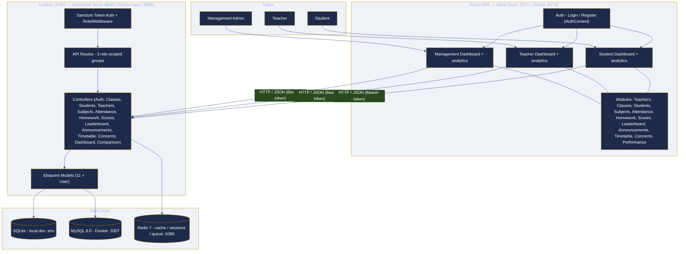
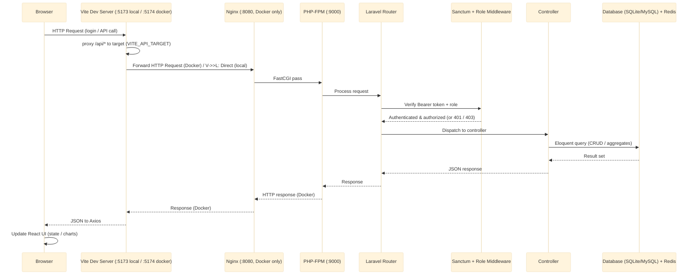
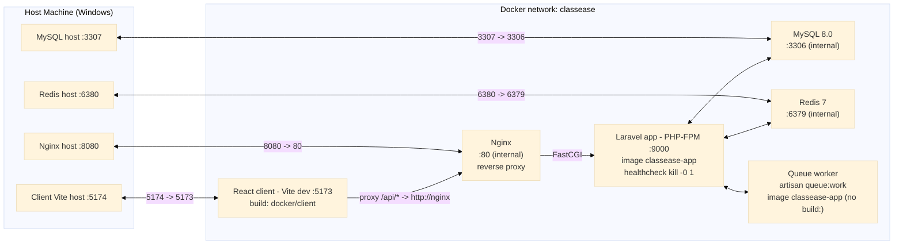
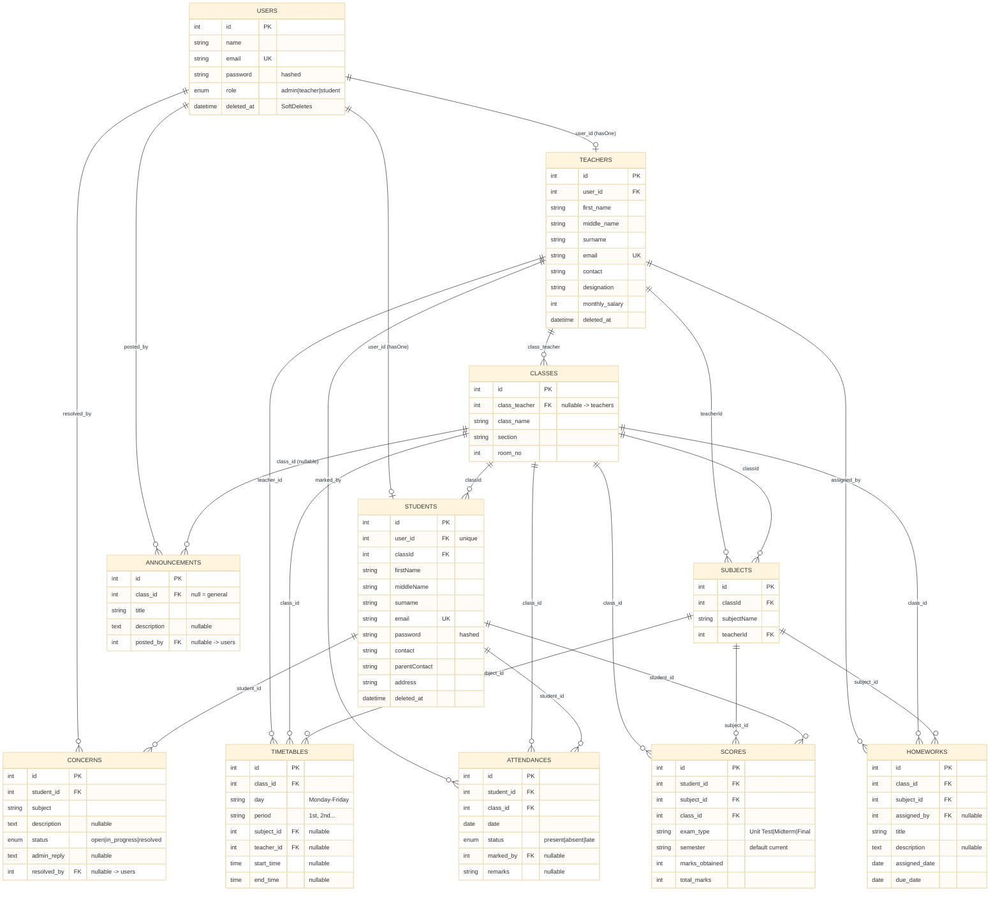
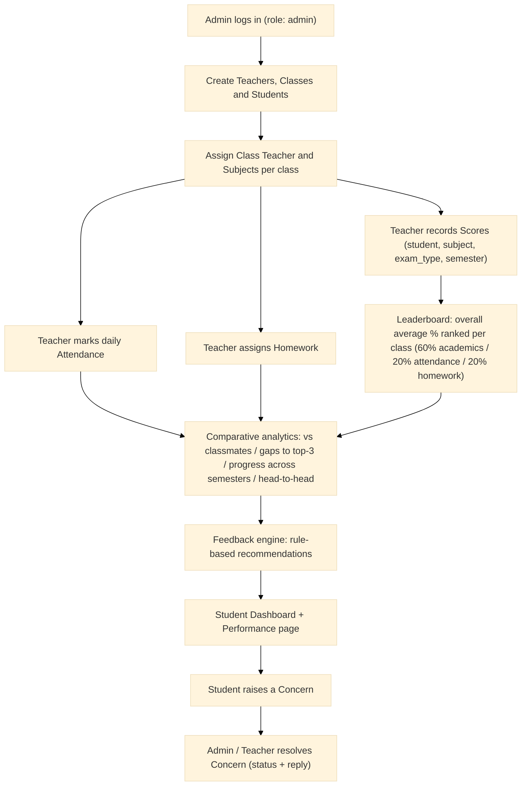
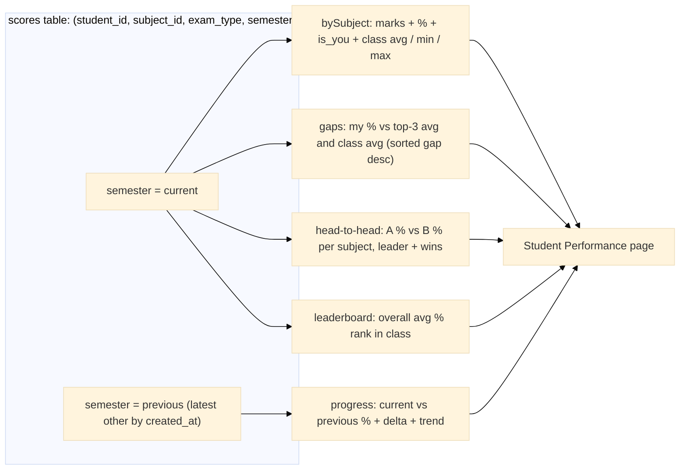
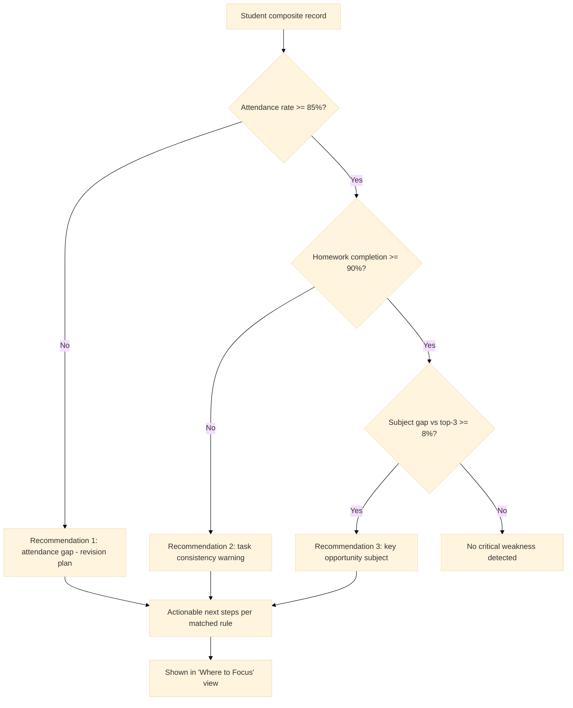

# ClassEase — Diagram Source Code (Mermaid)

Render with mermaid.ink, VS Code 'Markdown Preview Mermaid Support', or Typora.
mermaid.ink URL pattern (browser): prefix a base64 encoded graph with https://mermaid.ink/img/

---

## 1-architecture-high-level

---

## 2-request-flow-sequence

---

## 3-docker-architecture

---

## 4-erd

---

## 5-role-hierarchy

```mermaid
%%{init: {'theme':'base','themeVariables':{'fontFamily':'Segoe UI'}}}%%
graph TB
    subgraph ADMIN["Management (Admin) - Full Access"]
        A1["Classes / Teachers / Students / Subjects CRUD"]
        A2["Dashboard stats + analytics"]
        A3["Attendance - mark & view"]
        A4["Homework CRUD"]
        A5["Scores CRUD + Leaderboard"]
        A6["Announcements + Timetable"]
        A7["Concerns - manage"]
        A8["Performance - head-to-head any two students"]
    end

    subgraph TEACHER["Teacher - Limited Access"]
        T1["Own profile (/teacher/me)"]
        T2["Own subjects + classes"]
        T3["Marks (own subjects)"]
        T4["Attendance (own classes)"]
        T5["Homework (own subjects only)"]
        T6["Announcements + Timetable editor"]
        T7["Concerns - view/manage (no delete)"]
        T8["Performance - head-to-head"]
    end

    subgraph STUDENT["Student - Read-Only (+ raise concerns)"]
        S1["Own profile (/student/me)"]
        S2["Own class + subjects + attendance"]
        S3["Own scores + leaderboard"]
        S4["Performance - vs class / rank / focus / progress / head-to-head"]
        S5["Timetable + announcements + homework"]
        S6["Concerns - raise + track own"]
    end

    ADMIN --> TEACHER --> STUDENT
```

---

## 6-navigation-flow

```mermaid
%%{init: {'theme':'base','themeVariables':{'fontFamily':'Segoe UI'}}}%%
graph TD
    START(["Login (/)"]) --> AUTH{"AuthContext<br/>token valid?"}
    AUTH -->|"no token"| START
    AUTH -->|"valid"| ROLE{"User role"}

    ROLE -->|"admin"| ADASH["Management Dashboard<br/>/management/dashboard"]
    ROLE -->|"teacher"| TDASH["Teacher Dashboard<br/>/teacher/dashboard"]
    ROLE -->|"student"| SDASH["Student Dashboard<br/>/student/dashboard"]

    ADASH --> ASTUD["Students by class (add / edit / subjects)<br/>/management/students"]
    ADASH --> ATEACH["Teachers (add / edit / subjects)<br/>/management/teachers"]
    ADASH --> ACLASS["Classes (add / edit)<br/>/management/classes"]
    ADASH --> ASUBJ["Subjects (add / edit)<br/>/management/subjects"]
    ADASH --> AATT["Attendance (mark / view)<br/>/management/attendance"]
    ADASH --> AHW["Homework (list / add / edit)<br/>/management/homework"]
    ADASH --> ASCORE["Scores (list / add / edit)<br/>/management/scores"]
    ADASH --> ALEAD["Leaderboard (class + exam + semester)<br/>/management/leaderboard"]
    ADASH --> AANN["Announcements (list / add / edit)<br/>/management/announcements"]
    ADASH --> ATT["Timetable (grid editor)<br/>/management/timetable"]
    ADASH --> ACON["Concerns (manage)<br/>/management/concerns"]
    ADASH --> APERF["Performance (head-to-head)<br/>/management/performance"]
    ADASH --> AANL["Analytics (6 detail pages)<br/>/management/analytics/*"]

    TDASH --> TMARKS["Marks (own subjects)<br/>/teacher/scores"]
    TDASH --> TATT["Attendance (own classes)<br/>/teacher/attendance"]
    TDASH --> TT["Timetable (editor + my periods)<br/>/teacher/timetable"]
    TDASH --> THW["Homework (own subjects)<br/>/teacher/homework"]
    TDASH --> TANN["Announcements<br/>/teacher/announcements"]
    TDASH --> TCON["Concerns (no delete)<br/>/teacher/concerns"]
    TDASH --> TPERF["Performance (head-to-head)<br/>/teacher/performance"]
    TDASH --> TANL["Analytics (3 detail pages)<br/>/teacher/analytics/*"]

    SDASH --> SPERF["Performance (5 tabs)<br/>/student/performance"]
    SDASH --> ST["Own Timetable<br/>/student/timetable"]
    SDASH --> SCON["Concerns (raise + track)<br/>/student/concerns"]
    SDASH --> SANL["Analytics (5 detail pages)<br/>/student/analytics/*"]
```

---
Done.

---

## Additional project-flow diagrams (blackbook)

### 0-process-flow

### 0-comparative-flow

### 0-feedback-engine

